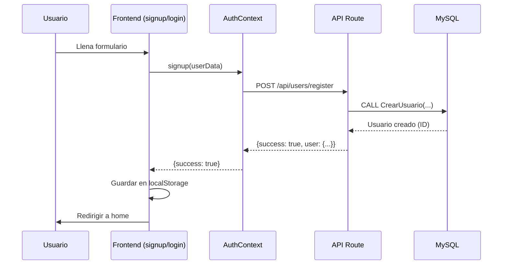

# ✅ Login y Signup Conectados a MySQL

## 🎯 Cambios Realizados

### 1. AuthContext Migrado a MySQL
**Archivo**: `src/context/AuthContext.js`

**Antes** (localStorage mock):
```javascript
const login = (email, password) => {
  const foundUser = users.find(u => u.email === email && u.password === password);
  // ...
};
```

**Después** (MySQL API):
```javascript
const login = async (email, password) => {
  const response = await fetch('/api/users/login', {
    method: 'POST',
    body: JSON.stringify({ correo: email, password })
  });
  // ...
};
```

### 2. Página de Login Actualizada
**Archivo**: `src/app/login/page.js`

- ✅ Manejo asíncrono de login
- ✅ Estado de carga (`loading`)
- ✅ Mensajes de error mejorados
- ✅ Botón deshabilitado durante carga

### 3. Página de Signup Actualizada
**Archivo**: `src/app/signup/page.js`

- ✅ Manejo asíncrono de registro
- ✅ Estado de carga (`loading`)
- ✅ Mensajes de error de la API
- ✅ Botón deshabilitado durante carga

### 4. Variables de Entorno
**Archivo**: `.env.local` (creado)

```env
DB_HOST=localhost
DB_USER=root
DB_PASSWORD=1042849815
DB_NAME=marketplace_db
```

---

## 🧪 Cómo Probar

### 1. Reiniciar el Servidor

**IMPORTANTE**: Debes reiniciar el servidor para cargar las variables de entorno:

```bash
# Detener el servidor actual (Ctrl+C)
# Luego iniciar de nuevo:
npm run dev
```

### 2. Probar Registro

1. Ve a: `http://localhost:3000/signup`
2. Llena el formulario:
   - **Nombre**: Juan Pérez
   - **Email**: juan@test.com
   - **Password**: test123
3. Click en "Sign Up"
4. Deberías ser redirigido a la página principal
5. Verás tu nombre en el header: "HOLA, JUAN PÉREZ"

### 3. Probar Login

1. Cierra sesión
2. Ve a: `http://localhost:3000/login`
3. Ingresa las credenciales:
   - **Email**: juan@test.com
   - **Password**: test123
4. Click en "Log In"
5. Deberías iniciar sesión exitosamente

### 4. Verificar en la Base de Datos

```bash
mysql -u root -p1042849815 -e "USE marketplace_db; SELECT * FROM Usuarios;"
```

Deberías ver el usuario creado en la tabla.

---

## 🔄 Flujo Completo



---

## 📁 Archivos Modificados

1. ✅ [src/context/AuthContext.js](file:///Users/camilochaves/Documents/marketplace/src/context/AuthContext.js)
2. ✅ [src/app/login/page.js](file:///Users/camilochaves/Documents/marketplace/src/app/login/page.js)
3. ✅ [src/app/signup/page.js](file:///Users/camilochaves/Documents/marketplace/src/app/signup/page.js)
4. ✅ `.env.local` (creado)

---

## ⚠️ Notas Importantes

### Seguridad
- ❌ **Las contraseñas NO están hasheadas** (solo texto plano)
- ❌ **No hay validación de fortaleza de contraseña**
- ⚠️  Solo para desarrollo/demo

### Próximos Pasos de Seguridad

1. **Hashear contraseñas con bcrypt**:
```bash
npm install bcryptjs
```

2. **Implementar JWT para sesiones**:
```bash
npm install jsonwebtoken
```

3. **Agregar validación de datos**:
```bash
npm install zod
```

---

## 🐛 Solución de Problemas

### Error: "Cannot connect to database"
- Verifica que MySQL esté corriendo
- Verifica las credenciales en `.env.local`
- Reinicia el servidor Next.js

### Error: "User already exists"
- El correo ya está registrado
- Usa otro correo o elimina el usuario de la DB

### El usuario no aparece en el header
- Verifica que el login fue exitoso
- Revisa la consola del navegador
- Verifica que `localStorage` tenga el usuario

---

## ✅ Estado Actual

- ✅ Login conectado a MySQL
- ✅ Signup conectado a MySQL
- ✅ Sesión persistente en localStorage
- ✅ Mensajes de error de la API
- ✅ Estados de carga
- ⏳ Falta: Hash de contraseñas
- ⏳ Falta: JWT tokens
- ⏳ Falta: Validación robusta
